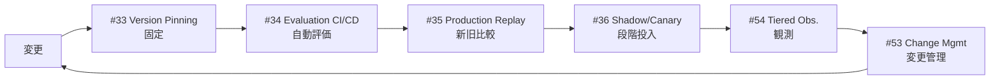

# 6. 継続改善運用構成

!!! abstract "一言"
    本番稼働後の品質維持・改善サイクルを回すための、バージョン管理・評価・デプロイを組み合わせた6層構成。

## このアーキテクチャが必要になるとき

エージェントが本番環境で稼働し始めると、新しい課題が浮上する。モデルのバージョンアップで回答品質が変わる。プロンプトを改善したつもりが、別のケースで劣化を引き起こす。本番トラフィックのパターンが事前テストと異なる。

こうした「本番稼働後にしか見えない問題」に対処するのがこの構成である。`[F8]` 説明責任が高い環境——金融、医療、法務、あるいは単に「品質に妥協できないプロダクト」——では、初期構築と同等以上の労力を運用改善に投じる必要がある。

この構成の原則は「変更を安全に、継続的に行える仕組み」を作ることである。全ての構成要素をバージョン管理し、変更のたびに自動評価を走らせ、段階的にデプロイする。「壊れてから直す」ではなく「壊れる前に検知する」運用を実現する。

## フォース評価

| フォース | 評価 | この構成での意味 |
|---------|------|----------------|
| `[F1]` 可逆性 | 中 | バージョン管理でロールバック可能にする |
| `[F2]` 失敗コスト | 中〜高 | 品質劣化がユーザー体験や信頼に直結する |
| `[F3]` 1リクエストの価値 | 中 | 個々より全体の品質傾向が重要 |
| `[F4]` レイテンシ予算 | — | 運用層は直接レイテンシに影響しない |
| `[F5]` 入力の信頼度 | — | 運用改善とは直交する |
| `[F6]` タスクの変動性 | 中〜高 | 本番トラフィックの多様性に対応する |
| `[F7]` コスト感度 | 中 | 観測のコスト自体を最適化する必要がある |
| `[F8]` 説明責任 | 高 | 品質の維持・改善を定量的に示す必要がある |
| `[F9]` プロバイダ信頼度 | 中 | モデル更新による品質変動に備える |

## 構成図

## 構成パターン一覧

| 層 | パターン | 役割 | なぜ必要か |
|---|---------|------|-----------|
| 固定 | [#33 Version Pinning](../patterns/07-observability/33-version-pinning.md) | 再現可能性の確保 | モデル・プロンプト・データのバージョンが固定されていないと、「いつ品質が変わったか」を特定できない |
| 評価 | [#34 Evaluation CI/CD](../patterns/07-observability/34-evaluation-ci-cd.md) | 変更毎の自動回帰検知 | 手動テストでは変更の影響を網羅的に検証できない |
| リプレイ | [#35 Production Replay](../patterns/07-observability/35-production-replay.md) | 新旧比較 | 合成テストでは本番トラフィックの多様性を再現できない |
| デプロイ | [#36 Shadow / Canary Deployment](../patterns/07-observability/36-shadow-canary-deployment.md) | 段階投入 | 全トラフィックを一括切り替えると、問題発生時の影響範囲が大きすぎる |
| 変更管理 | [#53 Agent Change Management](../patterns/12-governance/53-agent-change-management.md) | 変更プロセスの規律化 | 誰が・いつ・なぜ変更したかの記録がないと、品質劣化の原因追跡ができない |
| 観測 | [#54 Tiered Observability](../patterns/07-observability/54-tiered-observability.md) | コスト効率のよい観測 | 全トレースを全量保持するとストレージコストが爆発する |

## 各層の詳細

### 固定層 — Version Pinning

モデルのバージョン、プロンプトのバージョン、RAGデータソースのスナップショットを全て固定し、タグ付けする。「先週の月曜日の状態」を完全に再現できるようにする。この層がないと、モデルプロバイダのサイレントアップデートで品質が変動しても、「何が原因か」を特定できない。LLMの出力は非決定論的だが、入力条件を固定することで変動の範囲を限定できる。

### 評価層 — Evaluation CI/CD

プロンプトやモデルの変更がコミットされるたびに、自動評価パイプラインが走る。事前に定義した評価セット（質問と期待回答のペア）に対してスコアを算出し、閾値を下回ったら変更をブロックする。この層がないと、「プロンプトを良かれと思って変えたら、別のケースで品質が劣化した」という回帰を見逃す。

### リプレイ層 — Production Replay

本番で実際に受けたリクエスト（匿名化済み）を新しいバージョンで再実行し、旧バージョンとの出力差分を比較する。合成テストでは網羅できない、本番特有のエッジケースを発見できる。この層がないと、テスト環境では問題ないが本番で劣化する「暗黙の回帰」を検出できない。

### デプロイ層 — Shadow / Canary Deployment

新バージョンをまずShadowモード（本番トラフィックを複製して処理するが、結果は返さない）で検証し、問題なければCanary（全体の5〜10%に配信）に進め、段階的にトラフィックを増やす。この層がないと、全ユーザーが一斉に新バージョンの影響を受け、問題発覚時のロールバックが大規模になる。

### 変更管理層 — Agent Change Management

変更の提案、レビュー、承認、デプロイ、ロールバックのプロセスを定義し、記録する。「誰が・いつ・何を・なぜ変更したか」のログが残る。この層がないと、複数人が同時にプロンプトを変更して品質が劣化したとき、原因の切り分けができない。

### 観測層 — Tiered Observability

トレースの保存にホット（直近、全量）とコールド（過去、サンプリング）の階層を設ける。直近のトレースは高速にクエリでき、古いトレースは低コストストレージに移す。この層がないと、全トレースを全量保持してストレージコストが膨らむか、トレースを早期に削除して事後分析ができなくなるかのどちらかになる。

## 省略してよいもの・追加を検討するもの

- **省略可**: プロトタイプ段階やユーザー数が少ない間は、Shadow/Canary DeploymentよりもシンプルなBlue/Greenで十分。Production Replayも本番トラフィックが十分に溜まるまでは効果が薄い
- **追加検討**: `[F2]` が高い場合は [#28 Verifier Agent / Critic](../patterns/06-reliability/28-verifier-agent-critic.md) を評価パイプラインに組み込む。コスト観測が重要なら [#37 Semantic Gateway](../patterns/08-cost-scaling/37-semantic-gateway-cost-aware-router.md) のメトリクスをTiered Observabilityに統合する

## 具体的なシナリオ

金融機関の投資情報提供チャットボットを考える。規制当局への報告義務があり、回答品質の維持が必須条件である。月間リクエスト数は5万件。

開発チームがプロンプトを改善するたびに、Evaluation CI/CDが200件の評価セットに対して自動テストを実行する。正確性スコアが95%を下回ると、PRがマージできない。テストをパスした変更はVersion Pinningで新バージョンとしてタグ付けされる。

デプロイの前に、Production Replayが直近1週間の本番リクエスト（匿名化済み）1,000件を新旧バージョンで実行し、出力の差分レポートを生成する。「旧バージョンでは正しかったが新バージョンで誤る」ケースが5件以上あれば、デプロイを差し戻す。

問題がなければ、Shadow Deploymentで1日間、本番トラフィックの複製を新バージョンで処理する。Shadow結果と本番結果の差分が許容範囲内であれば、Canaryとして10%のトラフィックに配信する。1週間のCanary期間を経て、全トラフィックに切り替える。

Agent Change Managementが全ての変更を記録し、規制当局への報告書を自動生成する。Tiered Observabilityが直近30日のトレースをホット保持し、それ以前はコールドストレージに移す。監査時には必要な期間のトレースを復元して提出できる。

## 発展パス

- `[F2]` が高まったら → [事実性重視構成](04-factuality-first.md)のVerifier Agent、Evidence-Firstを評価パイプラインに組み込む
- `[F7]` が高まったら → [コスト重視構成](05-cost-first.md)の手法で観測コスト自体を最適化する
- チームが拡大したら → [#52 Agent Constitution](../patterns/12-governance/52-agent-constitution.md) で組織横断の品質基準を定義する
- 自律度を上げたい場合 → [#57 Autonomy Ladder](../patterns/06-reliability/57-autonomy-ladder.md) とEvaluation CI/CDを連動させ、品質スコアに応じて自律度を自動調整

## 関連する構成

- [事実性重視構成](04-factuality-first.md) — 品質維持が特に重要な場合に組み合わせる
- [コスト重視構成](05-cost-first.md) — 観測・評価のコストを最適化する手法を借りる
- [最小構成（MVP）](01-mvp.md) — MVPから本番化する際に追加する構成
