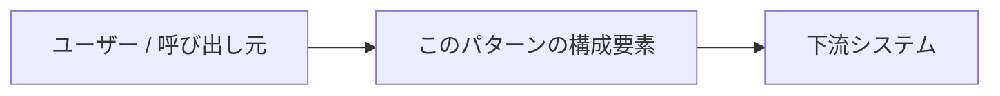

# #{{NUM}} {{TITLE}}

!!! abstract "一言"
    {{TAGLINE}}

## 概要

<!-- このパターンが何をするものか、2〜4文で。名前だけでは誤解されるため、何を・どこに置くパターンかを明示する。 -->

## 設計

<!-- どのコンポーネントを置き、どうデータが流れ、どこに境界・契約・検証・記録を作るか。
     必要なら mermaid 図を入れる（任意）。 -->

## 解決する課題

<!-- AIエージェントのどの特性・どの設計圧力に対応するか。「これが無いと本番で何が壊れるか」を書く。 -->

## 向き / 不向き

- **向き**: <!-- 適用すべき状況 -->
- **不向き**: <!-- 使うべきでない状況。ここを書くことでパターンが宣伝でなく道具になる。 -->

## 要素技術

<!-- 抽象論で終わらせず、具体的な実装候補に接続する。 -->

- 

## 調整（程度）

<!-- 目盛りを持つ場合のみ記載。無ければセクションごと削除可。
     形式: **<ダイヤル名>** — <小さすぎ ⇔ 大きすぎ> / 決め手 [F#] / 目安。
     詳細は決定層へリンク。 -->

- **<ダイヤル名>** — <小さすぎ ⇔ 大きすぎ> / 決め手 `[F#]` / 目安: <値>。→ [程度ダイヤル](../../decisions/tuning-dials.md)

## 選定（相反）

<!-- 相反する代替がある場合のみ記載。無ければセクションごと削除可。 -->

- **<選択肢A ↔ 選択肢B>** — 決定変数 `[F#]`。デフォルト: <…>。→ [相反の選定基準](../../decisions/tradeoffs.md)

## 関連パターン

<!-- 同カテゴリは ./NN-slug.md、別カテゴリは ../NN-category/NN-slug.md で相対リンク。最低1つ。 -->

- [#x ...](#) — 関係の一言

## 参考

<!-- 出典・規格・SDK等。任意。 -->

- 
